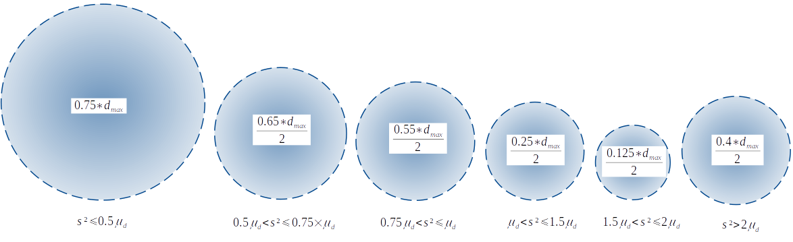
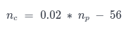
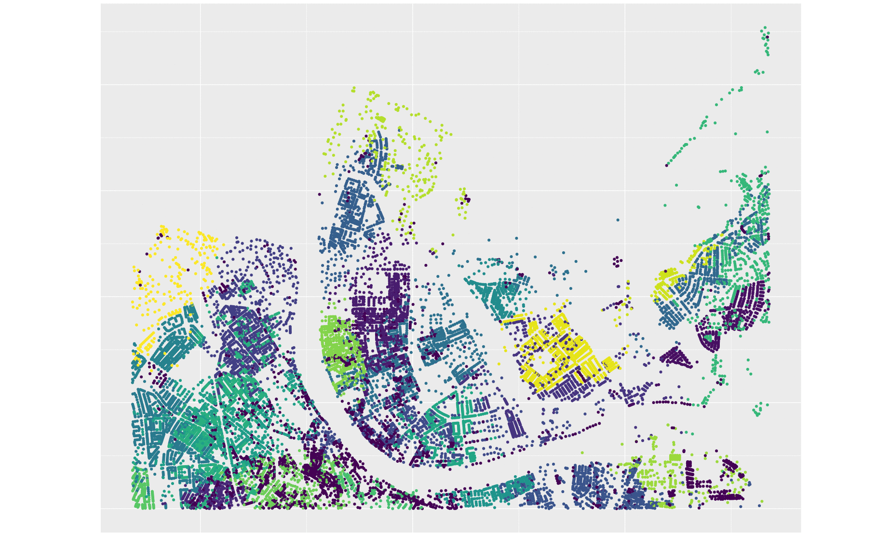
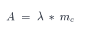
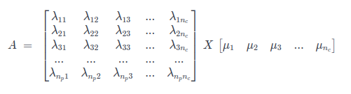

## Overview

This repository is related to the _RegBL (RBD/GWR/RegBL) completion_ research project. The _STDL_ was contacted by the Swiss Federal Statistical Office (_OFS_) to determine in which extend it could be possible to complete the construction date of Swiss buildings based on the analysis of a temporal sequence of the Swiss federal maps produced by _swisstopo_. With an initial target of _80%_ of correct guesses, the goal of this research project was to demonstrate the possibility to reach such goal using a reliable validation metric.

Intyearpolator is, as its name suggests, a spatial interpolator designed for predicting years of a random field. 

## Research Project Links

The following links give access to the codes related to the project :

* [Primary pipeline - Construction dates extraction using maps](https://github.com/swiss-territorial-data-lab/regbl-poc)
* [Secondary pipeline - Construction dates extraction without maps (This repository)](https://github.com/swiss-territorial-data-lab/regbl-poc-intyearpolator)
* [Results and analysis tools for the primary pipeline](https://github.com/swiss-territorial-data-lab/regbl-poc-analysis)

The following links give access to official documentations on the considered data :

* [RegBL : Swiss federal register of buildings and dwellings](https://www.bfs.admin.ch/bfs/en/home/registers/federal-register-buildings-dwellings.html)
* [Maps : Swiss national maps 1:25'000](https://shop.swisstopo.admin.ch/en/products/maps/national/lk25)


# intYEARpolator
This predictor was especially designed for infering the year of construction of buildings in Switzerland. Although this is supplementary to an object detection based algorithm working on the presence (or absence) of houses in swisstopo maps in comparison to RegBL (GWR) database. Therefere, this model is only extrapolating regbl-poc predictions to years beyond the oldest map available in some area. This is an add-on and should not replace the results from the main detector. Although you may find it interesting for testing, as its predictions are made for all null (*NaN*) values. Despite it's been designed for spatially interpolating the year of construction of houses, it may also be interesting in cases where the urban pattern structure could be relevant.

IntYEARpolator is a spatial statistcs model which main characteristics are to query for neighbour's data based on different searching radius and the use of a gaussian mixture model for clustering in estimations. First of all, a general searching radius is defined as half of the largest distance (between random variables). For every prediction location, the variance between all data in the 'prior' searching radius will be used to create a 'posterior' searching radius. This way, the higher the variance, the smaller the searching radius, as we tend to trust data less. The exception to this rule is for variances that are higher than 2 x the mean distance between points. In this case, the searching radius increases again in order to avoid clusters of very old houses that during tests caused understimation. The figure below demonstrates the logic behing the creation of buffers.



being *d* the distance between points, μ the mean and *s²* the sample variance. 

This first procedure is used to fill the gaps in the entry database. This completion is only done in the random variable column and not on the coordinates on. This is done so clustering can be computed. The unsupervised learning tool used is a gaussian mixture model, which does not only segments data into clusters, but as it is a probabilistic model, it will indicate the probability of each point belonging to every cluster. The number of components computed is a linear function to the total number of points being used, inclusing the ones that previously had gaps. The function to find the number of component is the following:



being *np* the number of components / clusters, and *nc* the total number of points used. The number of clusters shall usually be very large compared to a standard clustering exercise. This will enhance the degree of detailing in predictions. An example of clustering performed by the embedded gaussian mixture model can be seen below:



Hence the matrix of probabilities of every point belonging to each cluster (λ - what can be considered a matrix of weighs) is multiplied by the the mean of each cluster ( 1 x *nc* matrix *mc*), forming the *A* matrix :



or in matrices:



Finally the predictions (*Ẑ*) can then be made using the sum of each row in the *A* matrix.

# Usage

There are five possible entries to run the code, though only two are mandatory. Nevertheless be carefull, as the many of the optionals might be truly relevant depending n the file you're using. The two mandatory arguments are the **input** table path with ID columns, coordinates and random variables (usually year of construction) and the **output** table path, as below, in your terminal:

```
$python3 intyearpolator.py -i /path/to/input_table -o /path/to/output/predictions_table
```

There are then the "optional" arguments referring to the columns in the input table, being them: **latitude** (lat), **longitude** (long), **ID** (id) and **random variable** (ranvar). The examples below include these possibilities, but keep in mind that defaults are *GKODE* for longitude, *GKODN* for latitude, *EGID* for ID and *GBAUJ* for random varaiable, as these are the names used RegBL.

```
$python3 intyearpolator.py --input /path/to/input_table --output /path/to/output/predictions_table --long X_coord --lat Y_coord --id ID --ranvar YEAR
```
or
```
$python3 intyearpolator.py -i /path/to/input_table -o /path/to/output/predictions_table -x X_coord -y Y_coord --id ID -z YEAR
```
Make sure coordinates are in some metric system as UTM, as the distance computations are made through trigonometry. The truly optional argument concerns the plotting of the clusters as seen above. One can visualise the clusters computed the the **plot** argument, as below:

```
$python3 intyearpolator.py -i /path/to/input_table -o /path/to/output/predictions_table --plot 1
```
or
```
$python3 intyearpolator.py -i /path/to/input_table -o /path/to/output/predictions_table -p 1
```

Finally, an output table is generated containing the ID column, the two column coordinates, the *filled* column with the values from the first filling model here described a column with the *cluster* numbers and, at last, the *Z* column with final predictions. It shall look like this:

| EGID       | GKODE       | GKODN       | filled | cluster | Z |
|------------|-------------|-------------|--------|---------|---|
| 4235687563 | 2609390.653 | 1267274.362 | 1925   | 98      |1926
| 4235687570 | 2609390.241 | 1267274.153 | 1926   | 98      |1928
| ...        | ...         | ...         | ...    | ...     |...|


## Copyright and License

**regbl-poc-intyearpolator** - Huriel Reichel, Nils Hamel <br >
Copyright (c) 2020-2021 Republic and Canton of Geneva

This program is licensed under the terms of the GNU GPLv3. Documentation and illustrations are licensed under the terms of the CC BY-NC-SA.

## Dependencies

* Python 3.6 or superior

Packages can be installed either by pip or conda:

* pandas 1.2.0

* numpy 1.18.4

* scipy 1.5.4

* scikit-learn 0.24.0
